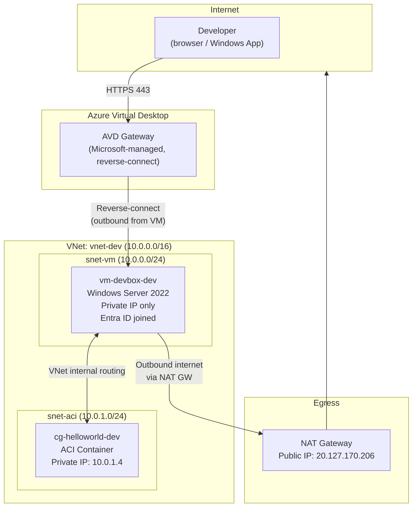
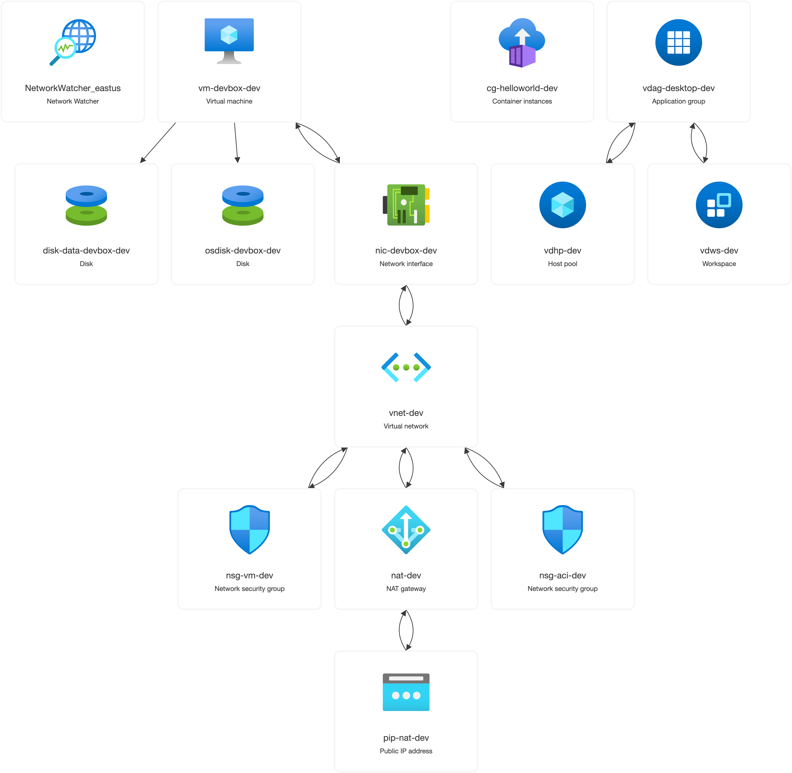
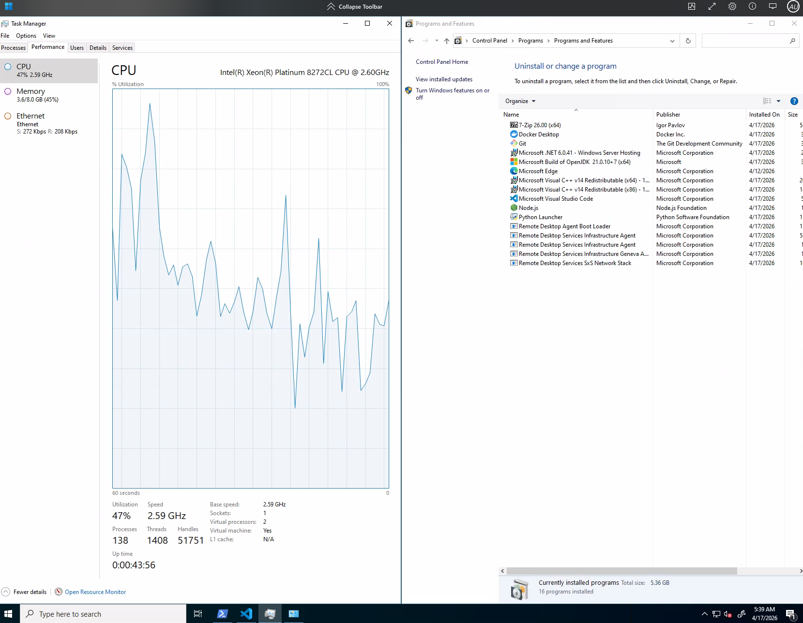
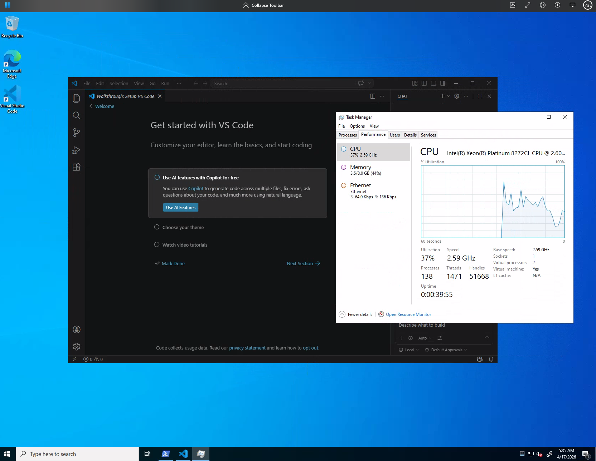
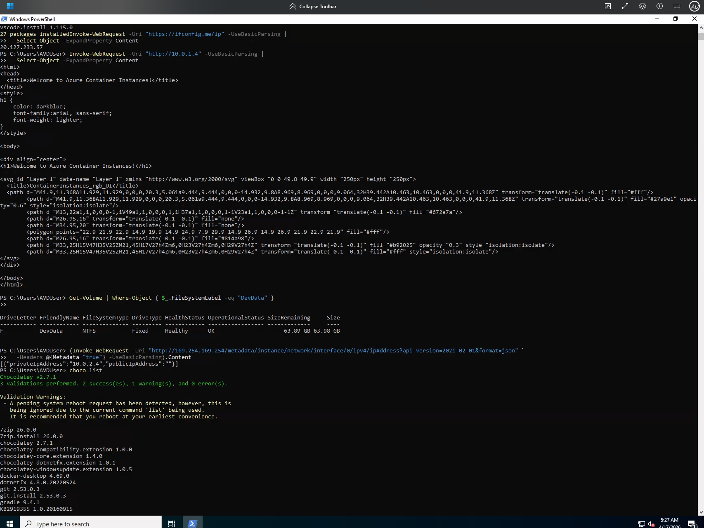
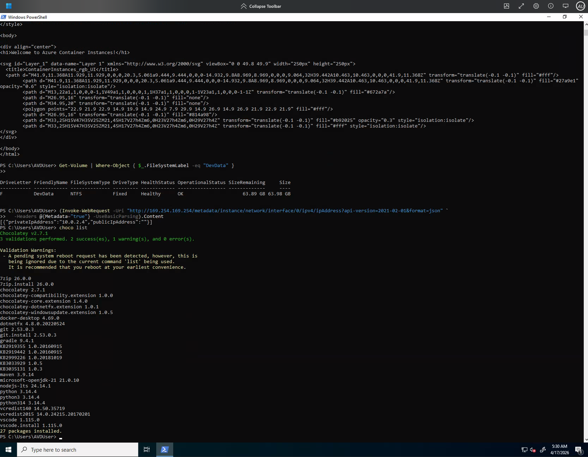
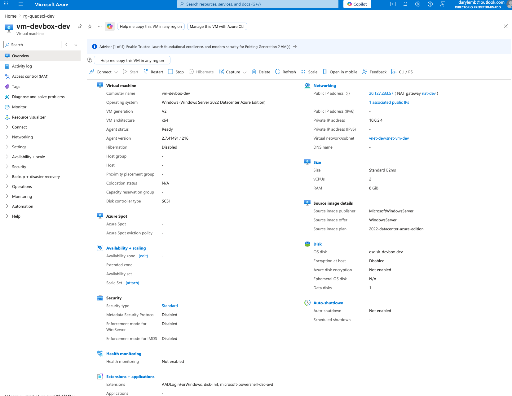

# quadsci-challenge — Azure Private Infrastructure (Terraform)

A fully private Azure environment. No workload has a public IP. Remote development access is provided through Azure Virtual Desktop (AVD) reverse-connect. Outbound internet from the VM subnet is routed through a NAT Gateway.

## Architecture





**Networking properties:**

| Property | Value |
|---|---|
| VNet | `vnet-dev` — `10.0.0.0/16` |
| VM subnet | `snet-vm` — `10.0.0.0/24` |
| ACI subnet | `snet-aci` — `10.0.1.0/24` |
| Public IPs on workloads | **None** |
| VM access | AVD reverse-connect (outbound 443 from VM) |
| Outbound internet | NAT Gateway (`20.127.170.206`) |
| ACI access | Private IP only (`10.0.1.4`) |
| Authentication | Entra ID join + AVD — no domain controller |

---

## Project Structure

```
quadsci-challenge/
├── .gitignore
├── README.md
├── scripts/
│   ├── init-backend.sh          # One-time backend bootstrap (az CLI)
│   └── local-plan.sh            # Convenience wrapper: init + plan with local.tfvars
└── terraform/
    ├── bootstrap/                # One-time SP + RBAC setup (local state, run once)
    ├── modules/
    │   ├── networking/           # VNet, subnets, NSG, NAT GW
    │   ├── container/            # ACI private container group
    │   ├── devbox/               # Windows VM + data disk + AVD extensions
    │   ├── avd/                  # AVD workspace, host pool, app group
    │   └── avd-users/            # Entra ID users + AVD/VM RBAC assignments
    └── environments/
        └── dev/                  # Dev environment root (tfvars, backend, provider)
```

---

## Prerequisites

| Tool | Version |
|------|---------|
| Terraform | ≥ 1.7 |
| Azure CLI (`az`) | ≥ 2.55 |
| Azure subscription | with Owner or Contributor + UAA roles |

---

## Deploying to a New Azure Account

If someone else wants to test this in their own Azure subscription, they only need to provide two values and follow the steps below.

### What you need from the new account

| Value | How to find it |
|---|---|
| **Subscription ID** | Azure Portal → Subscriptions, or `az account show --query id -o tsv` |
| **Tenant ID** | Azure Portal → Microsoft Entra ID → Overview, or `az account show --query tenantId -o tsv` |

### Required permissions

The identity running `terraform apply` needs at minimum:
- **Contributor** on the subscription (create VMs, VNets, ACI, NAT GW, etc.)
- **User Access Administrator** on the subscription (assign AVD/VM RBAC roles)
- **User Administrator** in Entra ID (create AVD user accounts)

The easiest option is **Owner** on the subscription, which covers all three.

---

## Quickstart

### 1. Authenticate to Azure

```bash
az login
az account set --subscription "<SUBSCRIPTION_ID>"
```

### 2. (Optional) Bootstrap the Terraform state backend

Skip this step to use **local state** (fine for testing). To use Azure Storage for remote state:

```bash
chmod +x scripts/init-backend.sh
./scripts/init-backend.sh dev eastus
```

This creates:
- Resource group `rg-tfstate-dev`
- Storage account `tfstate<random>dev` (HTTPS-only, TLS 1.2, no public blob access)
- Blob container `tfstate`

Then update `terraform/environments/dev/backend.tf` with the printed values.  
To use local state instead, set `backend.tf` to:

```hcl
terraform {
  backend "local" {
    path = "terraform.tfstate"
  }
}
```

### 3. Create `local.tfvars`

Create `terraform/environments/dev/local.tfvars` (this file is gitignored — never commit it):

```hcl
tenant_id       = "<TENANT_ID>"
subscription_id = "<SUBSCRIPTION_ID>"
client_id       = "local-az-login"   # uses az login — no service principal needed
admin_password  = "VmPassword1!Seguro"

avd_users = {
  "avduser" = {
    display_name = "AVD User"
    password     = "AvdPassword1!Seguro"
  }
}
```

Password rules: 12+ characters, uppercase, lowercase, digit, and symbol.

> **Security:** `local.tfvars` is gitignored. Never commit real credentials.

### 4. Plan

```bash
./scripts/local-plan.sh
```

Review the output — expect ~25 resources to be created. No changes are applied at this step.

### 5. Apply

```bash
terraform -chdir=terraform/environments/dev apply -var-file="local.tfvars"
```

This takes approximately 20–30 minutes. The VM extensions (AAD join + AVD DSC registration) and dev tools installation (Chocolatey) are the slowest parts.

### 6. Import an existing AVD user (only if created manually before)

If `avduser` was created outside of Terraform (e.g. via `az ad user create`), import it before applying to avoid a conflict:

```bash
terraform -chdir=terraform/environments/dev import \
  -var-file="local.tfvars" \
  'module.avd_users.azuread_user.this["avduser"]' \
  "<OBJECT_ID>"
```

Then run `apply` again.

### 7. Managing AVD users

To add a new user, add an entry to the `avd_users` map in `local.tfvars` and run `apply`. The key becomes the username prefix (e.g. `"devuser2"` → `devuser2@<tenant>.onmicrosoft.com`):

```hcl
avd_users = {
  "avduser" = {
    display_name = "AVD User"
    password     = "Password1!Secure"
  }
  "devuser2" = {
    display_name = "Dev User 2"
    password     = "Password2!Secure"
  }
}
```

### 8. Verify dev tools installation (optional)

After `apply` completes, the dev tools run in background (~15 min). To check progress from your local machine:

```bash
az vm run-command invoke \
  --resource-group rg-quadsci-dev \
  --name vm-devbox-dev \
  --command-id RunPowerShellScript \
  --scripts "choco list --local-only" \
  --query "value[0].message" -o tsv
```

Or from inside the AVD session:

```powershell
choco list --local-only
java -version
python --version
node --version
git --version
```

---

## Connecting to the VM via AVD

1. Open the [AVD web client](https://client.wvd.microsoft.com/arm/webclient/) in a browser  
   (or install **Windows App** on macOS/Windows/iOS).

2. Sign in with the Entra ID user created by Terraform:  
   `avduser@<tenant>.onmicrosoft.com`

3. Click **Developer Workspace** — a full Windows desktop session on `vm-devbox-dev` will open.

> **First login note:** The VM may take 2–5 minutes to become available after `terraform apply` completes, while the AVD agent finishes its registration.

> **AAD join note:** If the session host shows `Unavailable` after apply, verify the VM is AAD-joined: `az vm run-command invoke --resource-group rg-quadsci-dev --name vm-devbox-dev --command-id RunPowerShellScript --scripts "dsregcmd /status | Select-String 'AzureAdJoined'" --query "value[0].message" -o tsv`. If `AzureAdJoined: NO`, a stale device object may exist in Entra ID — delete it with `az rest --method DELETE --url "https://graph.microsoft.com/v1.0/devices/<object-id>"` and re-run the AAD join extension.

---

## Verifying the Infrastructure

### Dev tools pre-installed on the VM

| Tool | Chocolatey package |
|---|---|
| Java 21 (Microsoft OpenJDK) | `microsoft-openjdk-21` |
| Python | `python` |
| Node.js LTS | `nodejs-lts` |
| VS Code | `vscode` |
| Git | `git` |
| Maven | `maven` |
| Gradle | `gradle` |
| Docker Desktop | `docker-desktop` |
| 7-Zip | `7zip` |
| Chrome | `googlechrome` |

Customize the list in `local.tfvars`:

```hcl
dev_tools_packages = ["microsoft-openjdk21", "python", "nodejs-lts", "vscode", "git"]
```

Set to `[]` to skip dev tools installation entirely.





### From inside the AVD session (PowerShell)

```powershell
# 1. Confirm outbound internet goes through the NAT Gateway
#    Expected output: the NAT GW public IP (e.g. 20.127.170.206)
Invoke-WebRequest -Uri "https://ifconfig.me/ip" -UseBasicParsing |
  Select-Object -ExpandProperty Content

# 2. Confirm the ACI container is reachable via private IP
#    Expected output: the aci-helloworld HTML page
Invoke-WebRequest -Uri "http://10.0.1.4" -UseBasicParsing |
  Select-Object -ExpandProperty Content

# 3. Confirm the data disk is formatted (should show a DevData volume)
Get-Volume | Where-Object { $_.FileSystemLabel -eq "DevData" }

# 4. Confirm the VM has no public IP (should return empty)
(Invoke-WebRequest -Uri "http://169.254.169.254/metadata/instance/network/interface/0/ipv4/ipAddress?api-version=2021-02-01&format=json" `
  -Headers @{Metadata="true"} -UseBasicParsing).Content
```





### From your local machine (az CLI)

```bash
# Confirm no public IP is assigned to the VM (should return empty)
az vm show -g rg-quadsci-dev -n vm-devbox-dev --query publicIps -o tsv

# Confirm no public IP is assigned to the ACI container (should return empty)
az container show -g rg-quadsci-dev -n cg-helloworld-dev --query ipAddress.ip -o tsv

# Get the ACI private IP from Terraform output
terraform -chdir=terraform/environments/dev output container_private_ip
```



---

## Multi-Environment

To add `staging` or `prod`:

```bash
cp -r terraform/environments/dev terraform/environments/staging
# Edit backend.tf (change key = "staging.tfstate")
# Edit local.tfvars (change env = "staging", vm_size, etc.)
cd terraform/environments/staging && terraform init && terraform apply -var-file="local.tfvars"
```

No module changes are required.

---

## Adding New Environments — Backend

Run the bootstrap script once per environment:

```bash
./scripts/init-backend.sh staging eastus
./scripts/init-backend.sh prod westeurope
```

---

## Assumptions & Design Decisions

1. **No public IPs on workloads.** The NAT Gateway has a public IP for outbound internet, but it is not attached to any VM or container. Inbound access to the VM uses AVD reverse-connect — the VM initiates outbound HTTPS (443), so no inbound firewall rule is needed.
2. **AVD instead of Bastion.** Access to the Windows dev VM uses Azure Virtual Desktop (Personal Host Pool). The VM registers itself via the DSC extension and becomes accessible through the AVD Gateway without any public IP or open inbound port.
3. **Entra ID join — no domain controller.** The VM is AAD-joined via the `AADLoginForWindows` extension. AVD users are native Entra ID accounts managed in the `avd-users` Terraform module. The Host Pool is configured with `targetisaadjoined:i:1;enablerdsaadauth:i:1;` in `custom_rdp_properties` — required for AAD-joined session hosts to connect through the AVD gateway. If re-deploying, ensure no stale device object exists in Entra ID with the same hostname (error: `error_hostname_duplicate`).
4. **Persistent data disk.** A dedicated 64 GB Premium LRS managed disk (LUN 0) is attached to the VM and protected by `prevent_destroy = true`. The `disk-init` CustomScriptExtension formats it as GPT/NTFS on first boot (idempotent). Store working data on the labelled volume, not on the OS disk.
5. **NAT Gateway on VM subnet only.** `snet-aci` is fully internal — the hello-world container has no outbound internet requirement.
6. **ACI access via private IP.** `dns_name_label` is not supported with `ip_address_type = "Private"`. Access the container from the VM using its private IP (available as a Terraform output and verified via `Invoke-WebRequest`).
7. **Local authentication.** `local.tfvars` sets `client_id = "local-az-login"` which tells the provider to use the current `az login` session. No service-principal secrets are stored locally. OIDC (`use_oidc = true`) is supported for CI/CD via the `bootstrap/` module.
8. **Admin password lifecycle.** `lifecycle { ignore_changes = [admin_password] }` on the VM prevents Terraform from reimaging the machine when the password is rotated via `local.tfvars`. Rotate passwords with `az vm user update` or the portal.
9. **Bootstrap is a one-time operation.** `terraform/bootstrap/` creates the Service Principal and RBAC assignments needed for CI/CD. It uses local state intentionally and is meant to be run once by a human with sufficient permissions. It is not part of the regular `environments/dev` apply cycle.
10. **Dev tools via Chocolatey.** Common development tools (Java, Python, Node.js, VS Code, Git, etc.) are pre-installed using `azurerm_virtual_machine_run_command` with Chocolatey. This runs after AVD registration and does not block the session host from becoming available. The package list is configurable via `dev_tools_packages` in `local.tfvars`. The DSC artifact URL is pinned to `Configuration_09-08-2022.zip` which is the latest version supporting the `aadJoin` parameter required for Entra ID-joined session hosts.
