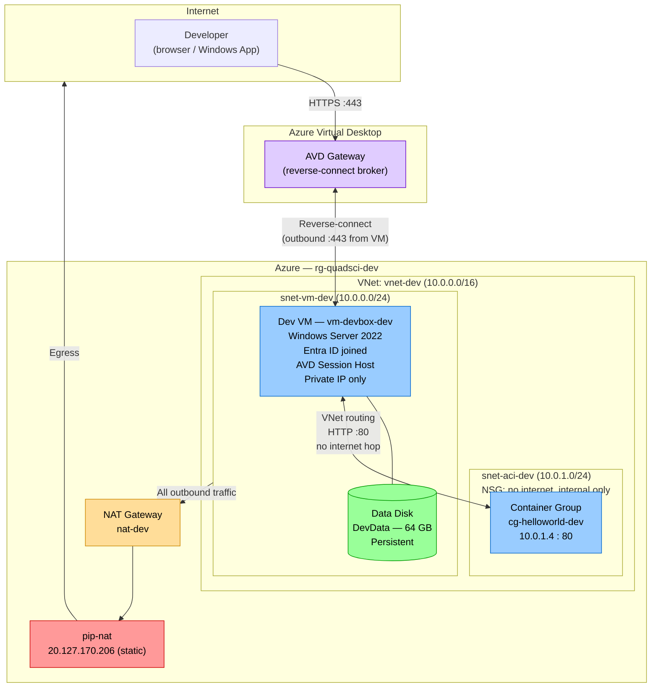

# Architecture Diagram

## Overview

```
┌─────────────────────────────────────────────────────────────────────────────────┐
│  Azure Subscription — Resource Group: rg-quadsci-dev                           │
│                                                                                  │
│   VNet: vnet-dev  (10.0.0.0/16)                                                 │
│  ┌────────────────────────────────────────────────────────────────────────────┐  │
│  │                                                                            │  │
│  │  ┌──────────────────────────────────────────────────────────────────────┐ │  │
│  │  │  snet-aci-dev  (10.0.1.0/24)                                         │ │  │
│  │  │  NSG: deny internet inbound/outbound                                  │ │  │
│  │  │                                                                       │ │  │
│  │  │  [ACI Container Group: cg-helloworld-dev]                            │ │  │
│  │  │   mcr.microsoft.com/aci-helloworld                                   │ │  │
│  │  │   Private IP: 10.0.1.4   Port 80 (internal only)                    │ │  │
│  │  └──────────────┬────────────────────────────────────────────────────────┘ │  │
│  │                 │ VNet routing                                              │  │
│  │  ┌──────────────▼────────────────────────────────────────────────────────┐ │  │
│  │  │  snet-vm-dev  (10.0.0.0/24)                                           │ │  │
│  │  │  NSG: deny internet inbound                                            │ │  │
│  │  │  NAT Gateway attached                                                  │ │  │
│  │  │                                                                        │ │  │
│  │  │  [VM: vm-devbox-dev]                                                  │ │  │
│  │  │   Windows Server 2022 Datacenter Azure Edition, Standard_B2ms         │ │  │
│  │  │   Private IP only  (NO public IP)                                     │ │  │
│  │  │   Entra ID joined (AADLoginForWindows extension)                      │ │  │
│  │  │   Registered as AVD Personal Session Host                             │ │  │
│  │  │   OS disk (Premium LRS)                                               │ │  │
│  │  │   Data disk (Premium LRS, 64 GB) ← persist across reimages            │ │  │
│  │  └──────────────────────────┬──────────────────────────────────────────────┘ │  │
│  │                             │ Outbound (via NAT GW)                          │  │
│  └─────────────────────────────┼──────────────────────────────────────────────┘  │
│                                │                                                  │
│            ┌───────────────────▼────────────────────┐                            │
│            │  NAT Gateway: nat-dev                   │                            │
│            │  pip-nat  20.127.170.206 (static)       │                            │
│            └───────────────────┬────────────────────┘                            │
└────────────────────────────────┼────────────────────────────────────────────────┘
                                 │
                                 ▼
                           [ Internet ]
                                 ▲
                                 │ (reverse-connect, outbound 443 from VM)
                    Azure Virtual Desktop Gateway
                                 ▲
                                 │ HTTPS :443
                          Developer (browser / Windows App)
```

---

## Mermaid Flowchart



---

## Traffic Flows

| Flow | Source | Destination | How |
|---|---|---|---|
| Developer → VM | Internet | `vm-devbox-dev` private IP | HTTPS :443 to AVD Gateway → reverse-connect (VM initiates outbound) |
| VM → Internet | `10.0.0.x` | Internet | NAT Gateway (`pip-nat` 20.127.170.206) |
| VM → ACI | `10.0.0.x` | `10.0.1.4:80` | VNet internal routing — no internet hop |
| ACI → Internet | **Blocked** | — | NSG denies outbound internet from `snet-aci` |
| Internet → VM | **Blocked** | — | NSG rule 4096 denies all internet inbound |
| Internet → ACI | **Blocked** | — | NSG rule 4096 denies all internet inbound |

---

## Resource Inventory

| Resource | Name | Subnet | Public IP |
|---|---|---|---|
| Virtual Network | `vnet-dev` | — | — |
| NAT Gateway | `nat-dev` | — (association to `snet-vm-dev`) | `pip-nat` 20.127.170.206 (egress only) |
| AVD Workspace | `ws-dev` | — (Microsoft-managed) | — |
| AVD Host Pool | `hp-dev` (Personal) | — | — |
| AVD App Group | `ag-desktop-dev` | — | — |
| Container Group | `cg-helloworld-dev` | `snet-aci-dev` | **None** |
| Windows VM | `vm-devbox-dev` | `snet-vm-dev` | **None** |
| Managed Data Disk | `disk-data-devbox-dev` | — | — |

---

## Notes

- **No public IPs on workloads.** The NAT Gateway has a public IP for outbound egress only. The VM and ACI have no public IPs. Inbound access to the VM uses AVD reverse-connect — the VM initiates the outbound connection, so no inbound port needs to be open.
- **AVD replaces Bastion.** Access to the Windows dev VM uses Azure Virtual Desktop (Personal Host Pool). No Bastion, no SSH key, no port 22.
- **Entra ID join.** The VM is joined to Azure AD via `AADLoginForWindows` + DSC extensions. No on-premises domain controller needed. Users are native Entra ID accounts.
- **NAT Gateway** handles egress for `snet-vm-dev` only. `snet-aci` is fully isolated — the container has no outbound internet requirement.
- **Persistence.** The data disk (LUN 0) is a separate Azure Managed Disk protected by `prevent_destroy = true`. The `disk-init` CustomScriptExtension formats it as GPT/NTFS on first boot (idempotent). Store working data on the `DevData` volume, not the OS disk.
- **OIDC auth.** `use_oidc = true` in the provider — no client secrets stored. Local development uses `az login` via `client_id = "local-az-login"`.
- **Multi-environment.** Duplicate `terraform/environments/dev/` → `staging/` or `prod/`, update `backend.tf` key and `local.tfvars`, run `init-backend.sh <new-env>`.
